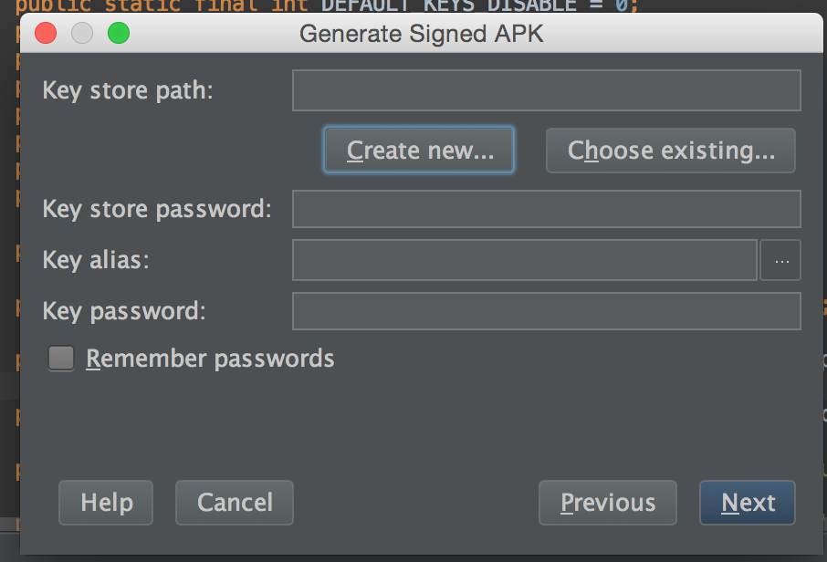
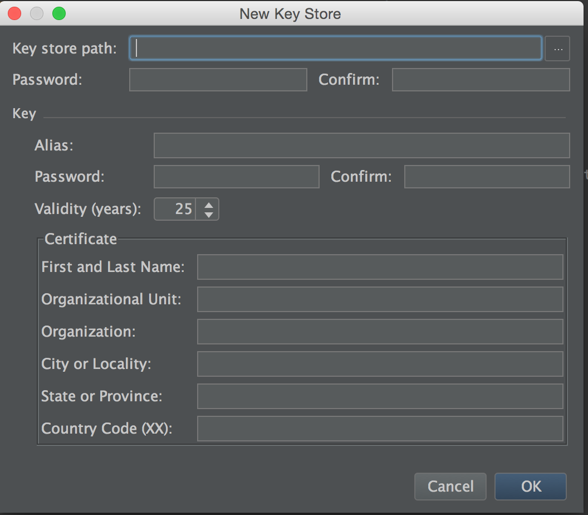
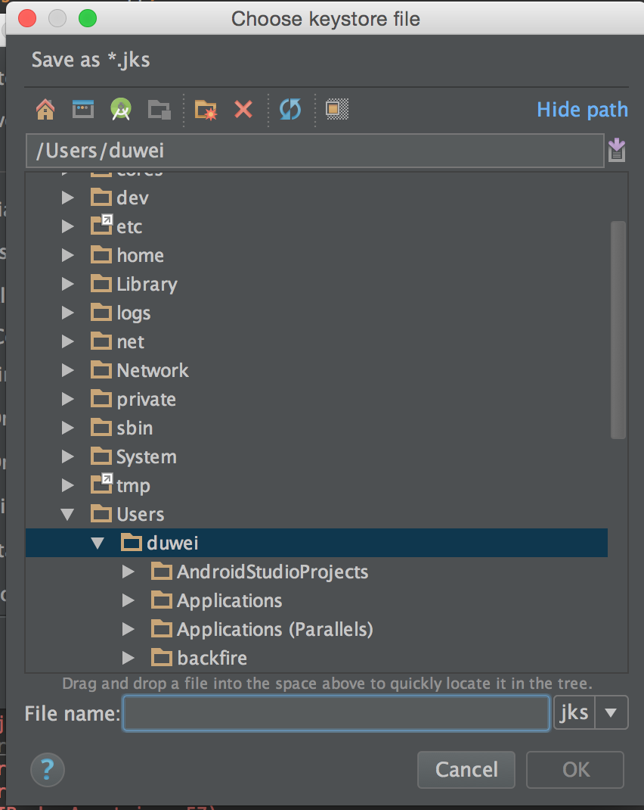
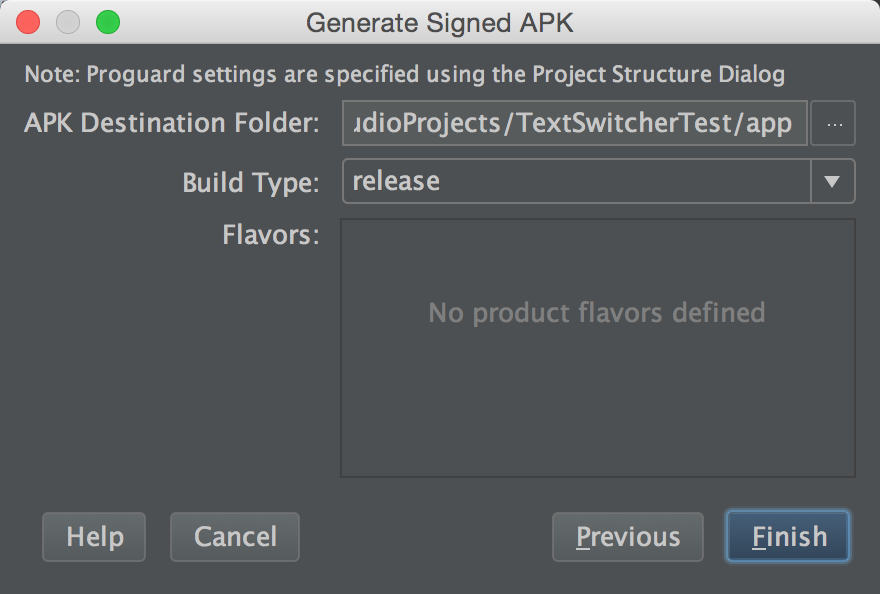

#10.使用 Android Studio打包签名apk
当你的项目进行到最后一步的时候，你会发现，想要发布你的 APP，还需要对它签名才行。
##为什么要签名
签名实际上就是 APP 发布者的身份认证，由于开发商可以通过使用 Package Name 来混淆替换已经安装的程序，也就是不同身份的开发商可能采用的相同的 APP 名字，这种情况下安装两个 APP 系统会认为是 APP 更新了，所以需要用不同的签名来保证来自不同开发商的同名软件不被替代。另外，签名也是为了保证信息传输的完整性，对应用签名的同时，签名会对包中的每个文件进行处理，以确保包中的内容不被替换，防止交易中的抵赖发生，这也是安卓市场对软件的要求。

##创建 KeyStore
在 Android Studio 的菜单栏中选择 Build -> Generate Signed Key，打开后如下图所示：

从图中可以看到，如果想要为程序签名，你还需要一个 KeyStore 文件，正如本章开头所提到的，签名是把你的相关信息加入的包中以防止同名应用的替换。而这些要加入包中的信息，就是通过 KeyStore 来保存的。如果已经有了自己的 KeyStore 直接选择然后输入密码就可以了。如果是第一次为程序签名，你还需要生成自己的 KeyStore。只需要点击 Create New 即可开始创建你的 KeyStore。

以上就是创建 KeyStore 的界面，除了选择 KeyStore 的路径外，你还需要为 KeyStore 设置密码，同时要为 KeyStore 设置 Alias，即别名和相应的密码。Validity 可以设置你希望这个 KeyStore 的有效期限，剩下的内容依次是你的姓与名、组织单位、组织名称、所在地、国家以及国家编号。（这些内容是选填的，关于国家编号可以查询谷歌的规范）

在创建 KeyStore的时候，需要注意，在选择 Key store path 的时候，你一定要输入 KeyStore 的名称才行。

也就是图中最下面的 File name 这一项，很多人第一次创建 KeyStore 时只注意选择路径而忘记了填写名称，导致 OK 键始终处于不可用的状态而无法完成创建，这一点需要注意。创建了 KeyStore 文件之后，你可以为项目设置 KeyStore 来运行，或者直接打包APK文件。

##打包 APK
导出APK文件基本和前面的步骤类似，Build -> Generate Signed Key 之后，填写你所生成的 KeyStore 的相关信息。

点击 next 之后进入如图所示的界面，第一行我们可以选择希望签名的程序，第二行选择你希望签名的程序类型，可以选择 debug 或者 release，前者用于调试，后者用于发布。完成之后，等到弹出窗口提示签名成功，你的 APK 文件已经打包生成了。生成的 APK 在你的项目的目录下，叫 app 的文件夹里面，如果选择 release 模式，你就会看到 xxx-release.apk，这就是最终打包生成的 APK 文件。你可以把它拿去各个应用市场发布，也可以直接给手机使用。

##为项目设置 KeyStore
有些时候，程序员并不需要打包 APK，可能只是想为程序设置好 KeyStore。这个时候只需要选择 Android Studio上方的 project structure 按钮来设置就行

打开 project structure 后，在 Modules 里选择 app，然后选择右边顶部的 Signing 标签。

如图，想要为项目添加 KeyStore，只需点击左下方的‘+’，然后依次输入相关的信息，你就成功为项目配置好 KeyStore了。 