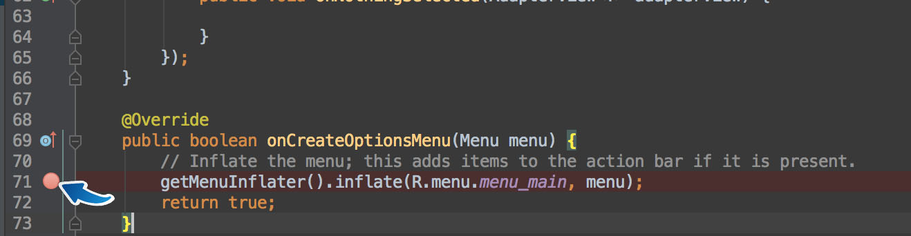
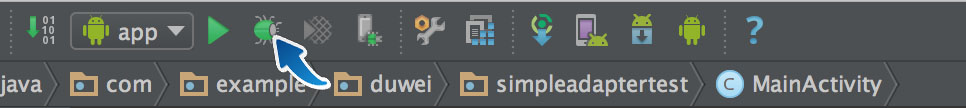
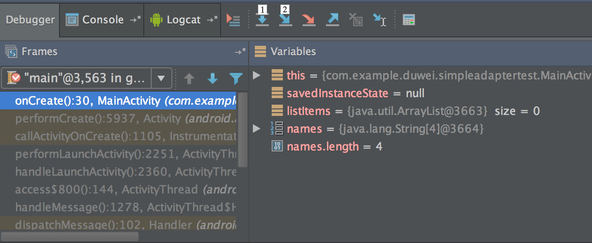

#8.基本断点debug调试技巧
当程序运行出现问题时，我们需要去找出其中的bug，本章节将从断点来介绍一下基本的debug技巧。
##断点
在 Android Studio 中选定代码行后，鼠标左键单击行号后面的区域即可设置断点。

如图所示，点击相应位置后，会出现一个红色的点，表明该处是断点，如果想要取消掉只需再次点击这个点即可。

##调试
要进行调试，必须以调试方式来运行项目。可以通过点击运行旁边的小虫来开始调试，也可以使用快捷键ctrl+D来启动。（Mac下是control+D）

开始调试以后的界面如下图：

1所在的位置是程序的方法调用栈区，按照调用的顺序从小自上排列。2是变量区，这里会显示程序中到达断点位置时存在的变量以及变量的值，如果有的值不对那么可以判断在这一步或者这一步之前有语句出错。如果该处变量的值都没有问题，就要开始进行调试。

##逐语句和逐过程

基本的调试方法主要分为两种，图中1号的逐过程和2号的逐语句。

###逐过程
如果想要使用逐过程，直接点击图标或者按F8即可。逐过程就是顺着程序运行的过程一步一步地运行下去，如果中间有函数调用，会执行函数，并在函数执行完之后停在调用语句的下一句。

###逐语句
逐语句可以通过F7快速使用，这个过程与逐过程的区别就是，它是按语句来停止，如果中间遇到了函数调用，那就会进入函数内部，在函数里面第一句话停下来。

