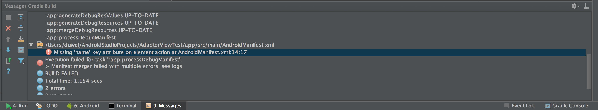
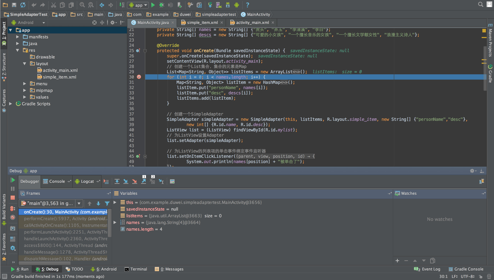

#8.基本断点debug调试技巧
当程序运行出现问题时，我们需要去找出其中的 bug，本章节将从断点开始介绍一下基本的 debug 技巧。首先看一下下面这张图

这是 Android studio 中运行出错时，下面控制台的信息，它指出了大概错误的地方，图中的错误是 AndroidManifest 文件中少了一个 name 属性。如果是在运行中哪个函数出错了，这里会按照程序调用的堆栈去追溯到出错的那个方法，帮助你快速确定问题位置。找到大概位置后，我们需要通过调试来找出问题的准确位置。
##断点
在 Android Studio 中选定代码行后，鼠标左键单击行号后面的区域即可设置断点。

如图所示，点击相应位置后，会出现一个红色的点，表明该处是断点，如果想要取消掉只需再次点击这个点即可。

##调试
要进行调试，必须以调试方式来运行项目。可以通过点击运行旁边的小虫来开始调试，也可以使用快捷键ctrl+D来启动。（Mac 下是 control+D）

开始调试以后的界面如下图：

1所在的位置是程序的方法调用栈区，按照调用的先后顺序从下自上排列。2是变量区，调试开始后会显示程序中到达断点位置时存在的变量以及变量的值，之后会随着用户的操作不断更新。如果有变量的值出现问题那么可以判断在这一步或者这一步之前有语句出错。如果该处变量的值都没有问题，就要开始进行调试。

##Step over & Step into

基本的调试方法主要分为两种，即图中1号的 Step over 和2号的Step into。

* **Step over**  如果想要使用 Step over，直接点击图标或者按F8即可。该过程就是顺着程序运行的过程一步一步地运行下去，如果中间有函数调用，会执行函数，执行完函数后，停在调用语句的下一个语句。

* **Step into**  Step into可以通过F7快速使用，这个过程与逐过程的区别就是，它是按语句来停止，如果中间遇到了函数调用，那就会进入函数内部，在函数里面第一句话停下来。

##Step out & Drop frame
在调试的过程中，完全靠 Step over 和 Step frame 是不够的，灵活使用 Step out 与 Drop frame 会使调试更加方便。

图中1所指的就是 Step out, 当你使用 Step into 进入某一个方法后，发现这个方法并没有什么问题，而该方法执行完又还有不少语句的时候，使用该功能可以让你迅速跳过这个方法，达到调用该方法语句的下一句。

图中2所指就是 Drop frame，如果你使用 Step into 进入某一个方法后，一不小心按快了，把有问题的语句跳过了，该功能可以让你回到当前调用方法的开始处，让你继续调试。

##Step force into
你可能注意到了，上面四个按钮中间还有一个红色的按钮，这个是 Step force into 按钮。这个按钮的功能是让你可以进入当前项目中的任何方法，请注意，使用这个功能意味着你已经脱离了当前的断点，而是从你所选择的任何一个方法开始执行时进行调试，对新手而言，不推荐使用这个方法。

##基本的调试技巧
一般来说，当程序运行出错后，首先看控制台对于函数调用栈的追溯，找到出现错误的函数，进行简单分析。找到大致的出错范围后，先设置断点
