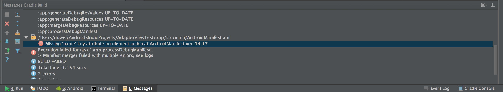
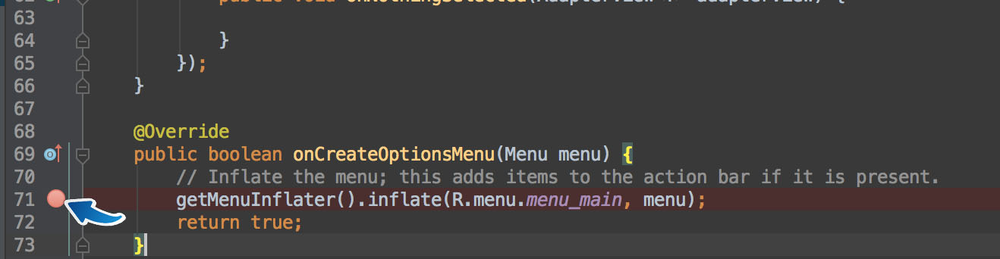
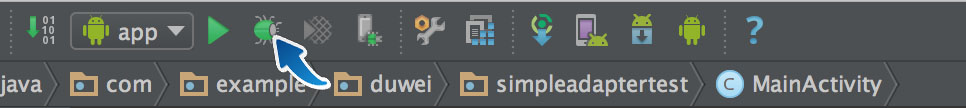
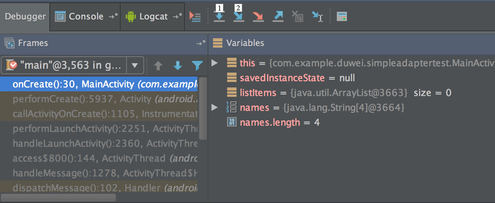
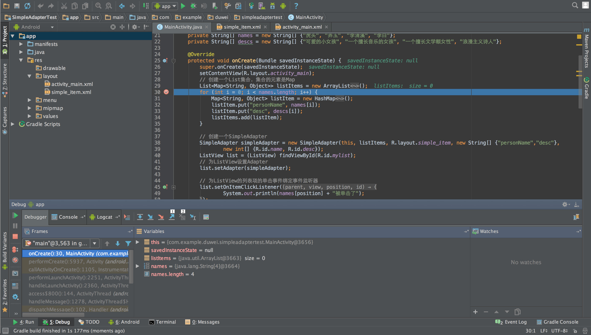
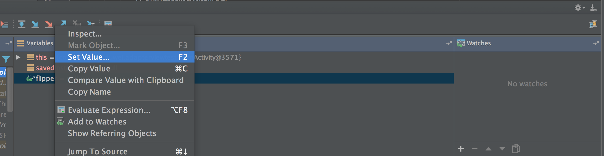
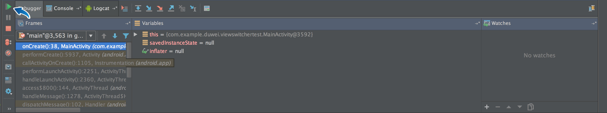
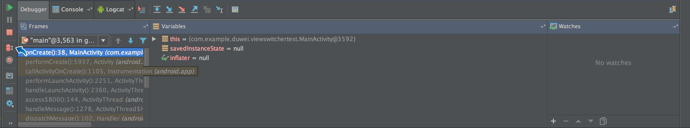
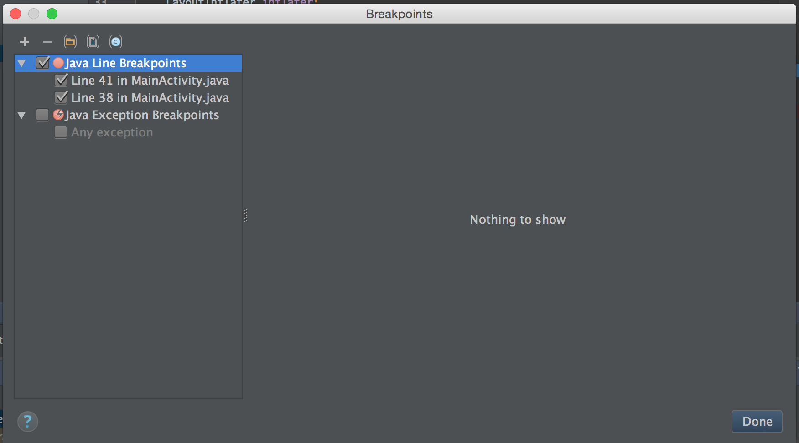
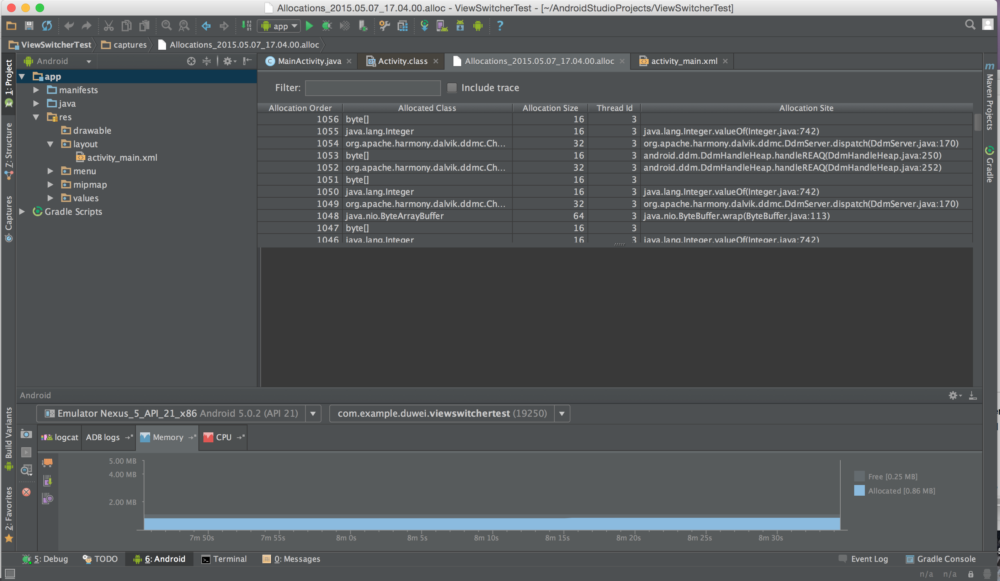

#8.基本断点debug调试技巧
当程序运行出现问题时，我们需要去找出其中的 bug，本章节将从断点开始介绍一下基本的 debug 技巧。首先看一下下面这张图

这是 Android studio 中运行出错时，下面控制台的信息，它指出了大概错误的地方，图中的错误是 AndroidManifest 文件中少了一个 name 属性。如果是在运行中哪个函数出错了，这里会按照程序调用的堆栈去追溯到出错的那个方法，帮助你快速确定问题位置。找到大概位置后，我们需要通过调试来找出问题的准确位置。
##断点
在 Android Studio 中选定代码行后，鼠标左键单击行号后面的区域即可设置断点。

如图所示，点击相应位置后，会出现一个红色的点，表明该处是断点，如果想要取消掉只需再次点击这个点即可。

##调试
要进行调试，必须以调试方式来运行项目。可以通过点击运行旁边的小虫来开始调试，也可以使用快捷键ctrl+D来启动。（Mac 下是 control+D）

开始调试以后的界面如下图：

1所在的位置是程序的方法调用栈区，按照调用的先后顺序从下自上排列。2是变量区，调试开始后会显示程序中到达断点位置时存在的变量以及变量的值，之后会随着用户的操作不断更新。如果有变量的值出现问题那么可以判断在这一步或者这一步之前有语句出错。如果该处变量的值都没有问题，就要开始进行调试。

##Step over & Step into

基本的调试方法主要分为两种，即图中1号的 Step over 和2号的Step into。

* **Step over**  如果想要使用 Step over，直接点击图标或者按F8即可。该过程就是顺着程序运行的过程一步一步地运行下去，如果中间有函数调用，会执行函数，执行完函数后，停在调用语句的下一个语句。

* **Step into**  Step into可以通过F7快速使用，这个过程与逐过程的区别就是，它是按语句来停止，如果中间遇到了函数调用，那就会进入函数内部，在函数里面第一句话停下来。

##Step out & Drop frame
在调试的过程中，完全靠 Step over 和 Step frame 是不够的，灵活使用 Step out 与 Drop frame 会使调试更加方便。

图中1所指的就是 Step out, 当你使用 Step into 进入某一个方法后，发现这个方法并没有什么问题，而该方法执行完又还有不少语句的时候，使用该功能可以让你迅速跳过这个方法，达到调用该方法语句的下一句。

图中2所指就是 Drop frame，如果你使用 Step into 进入某一个方法后，一不小心按快了，把有问题的语句跳过了，该功能可以让你回到当前调用方法的开始处，让你继续调试。

##Step force into
你可能注意到了，上面四个按钮中间还有一个红色的按钮，这个是 Step force into 按钮。这个按钮的功能是让你可以进入当前项目中的任何方法，请注意，使用这个功能意味着你已经脱离了当前的断点，而是从你所选择的任何一个方法开始执行时进行调试，对新手而言，不推荐使用这个方法。

##设置变量的值
在调试的过程中，也许你会对有些步骤感到怀疑，尽管当前程序的运行没有，但是可能存在一些特殊情况会使程序崩溃。这个时候你可以进入调试模式，在变量区里对你想监控的变量右键，选择 Set Value 就可以修改变量的值，然后继续运行，查看指定的步骤是否存在问题。

##使用多个断点进行调试
有时候，程序中可能存在多个有问题的地方，针对每个地方都设置断点分别调试比较麻烦，这时可以使用多个断点来调试。具体操作就是添加断点，在多个行前面设置断点，然后进入调试模式。

点击图中所示的按钮，可以直接从当前的断点运行至下一个断点处。

###查看断点
在设置多个断点调试的时候，如果断点设置过多，调试的时候可能会把断点弄混淆，这个时候可以点击查看断点按钮

点击该按钮之后，会弹出一个关于断点的界面

该界面上会显示出你所设置的全部断点，当你点击相应的断点之后，会显示出关于该断点的相应设置，同时下放还会显示该断点所在行的具体代码，方便你辨认断点。

##高级调试技巧
本节会简单的介绍一下高级调试技巧，但是不做深入研究，有兴趣的读者可以自行探究一下。
###内存分配
Android Studio 在调试的时候，还可以监控内存的分配状态，方便用户优化代码。具体操作如下，点击底部的 Android 标签，其中的 Memory 选项就可以查看当前程序的内存占用状况。并且，在 Memory 选项下面，左边的最后一个按钮可以监控各个方法的空间占用情况，点击之后开始监控，再次点击停止监控并将各个方法的空间占用情况输出，用户可以根据这部分信息来对代码进行优化。

##基本的调试技巧
一般来说，当程序运行出错后，首先看控制台对于函数调用栈的追溯，找到出现错误的函数，进行简单分析。找到大致的出错范围后，先设置断点。随后进入调试模式，在调试模式中使用上面讲过的几个按钮来进行调试，主要还是看变量的值。当发现变量的值出现问题的时候，仔细看一下当前语句以及前几句，从中找出问题并修改。修改完成之后再次调试验证，没有出现问题就意味着当前的 bug 已经解决。对于刚开始从事 Android 开发的同学来说，掌握这部分技巧已经足够，并且掌握基本调试技巧是十分必要的，有空的话可以配合实战的课程，自己尝试对一个程序进行调试。
